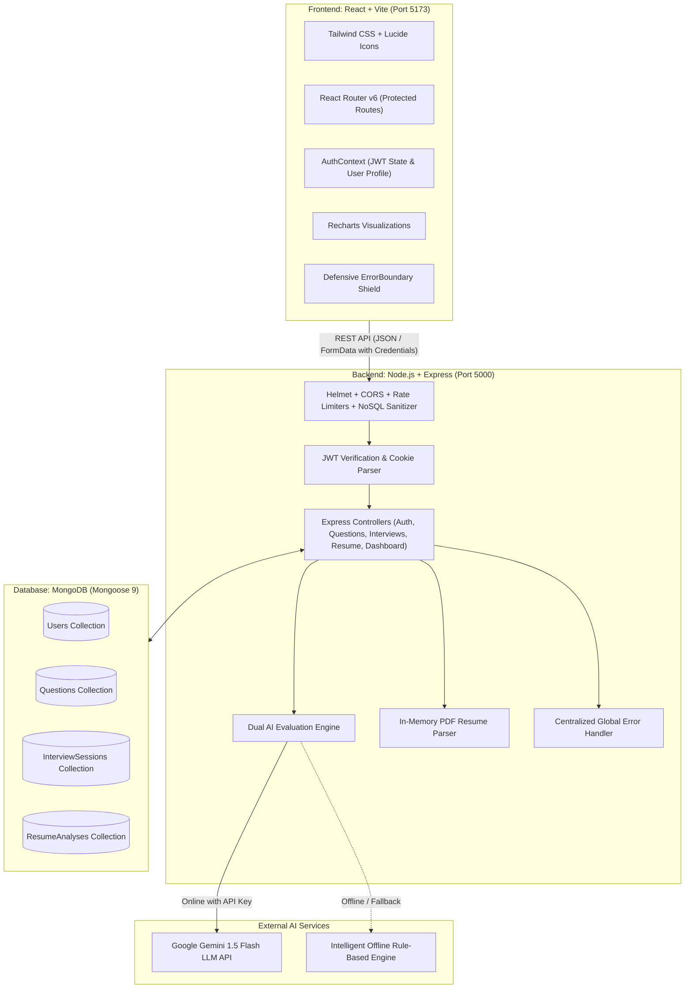

# 🎯 AI Interview Prep — Smart Placement Preparation Platform

[](https://reactjs.org/)
[](https://opensource.org/licenses/MIT)
[](https://nodejs.org/)
[](https://aistudio.google.com/)
[](https://helmetjs.github.io/)

A full-stack, production-ready web application engineered to solve the campus placement preparation challenge for engineering students. Unlike generic interview platforms, **AI Interview Prep** caters specifically to three distinct career tracks: **Software Developer (SDE)**, **Data Analyst**, and **ECE / Core Electronics (Embedded & VLSI)**.

It pairs an interactive mock interview simulator with a **Dual-Engine AI Evaluator** (Google Gemini 1.5 Flash + Intelligent Offline Mock Engine), providing rubric scores, technical correctness percentages, missing concept pills, and actionable feedback. It also features an **ATS Resume Matcher** and real-time performance analytics.

---

## 📑 Table of Contents
- [The Problem It Solves](#-the-problem-it-solves)
- [Key Features](#-key-features)
- [System Architecture](#-system-architecture)
- [Tech Stack](#-tech-stack)
- [Project Directory Structure](#-project-directory-structure)
- [Getting Started & Local Setup](#-getting-started--local-setup)
- [API Documentation](#-api-documentation)
- [Security & Defensive Engineering](#-security--defensive-engineering)
- [Campus Placement Presentation Guide](#-campus-placement-presentation-guide)
- [License](#-license)

---

## 💡 The Problem It Solves

During engineering campus placements, students face three massive hurdles:
1. **Unrealistic Practice:** Passively reading interview questions online does not train students to articulate technical definitions, analyze complexity, or handle countdown pressure.
2. **Lack of Core Electronics (ECE) & Data Focus:** Most prep sites cater solely to generic web development or basic DSA. ECE students targeting hardware/embedded companies (Embedded C, Microcontrollers, Digital Logic, Setup/Hold time) or Data Analyst aspirants (SQL Joins, Pandas, Statistics) find very few tailored platforms.
3. **No Instant Feedback on Written Answers:** Students never know whether their explanation is technically accurate, what essential keywords were missed, or how a placement interviewer would score their answer.

**AI Interview Prep solves this by acting as a 24/7 personal technical mentor.**

---

## 🚀 Key Features

### 1. 🎓 3 Specialized Career Tracks
- **Software Developer:** DSA, Object-Oriented Programming (OOP), Operating Systems, DBMS, Computer Networks.
- **Data Analyst:** Complex SQL & Joins, Python & Pandas, Statistics & Probability, Data Warehousing.
- **ECE / Core Electronics:** Digital Electronics, Embedded C, Microcontrollers (ARM Cortex / 8051), Setup & Hold Time, VLSI, Analog Circuits.

### 2. 📚 Filterable Question Bank
- 15+ curated questions seeded directly in MongoDB.
- Search by keyword with instant regex matching across titles, topics, and key concepts.
- Filter by Role, Topic, and Difficulty (Beginner, Intermediate, Advanced).
- Expandable hints and comprehensive model answers.
- User bookmarking system persisted in MongoDB.

### 3. ⏱️ Interactive Mock Interview Simulator
- Customizable interview creation: select track, topic, question count, and time limit.
- Single-question distraction-free runner with live countdown timer.
- Background answer autosaving per question.
- Session state tracking (`in_progress`, `completed`, `abandoned`).

### 4. 🧠 Dual-Engine AI Answer Evaluation
- **Primary Engine:** Google Gemini 1.5 Flash via REST API with structured JSON output schema.
- **Resilient Fallback:** Built-in rule-based `mockAiService` that activates when offline or if no API key is set.
- **Rubric Output:**
  - Overall score out of 10.0
  - Technical correctness percentage (0–100%)
  - Missing key concepts pills
  - Strengths and constructive improvement suggestions
  - Full model answer comparison

### 5. 📄 ATS Resume Analyzer & JD Matcher
- In-memory PDF text extraction using RAM buffer (zero orphaned files on disk).
- 60+ technical skill taxonomy matcher across SDE, Data, and ECE domains.
- Real-time Match Score % against pasted Job Descriptions.
- Missing skills gap list and actionable bullet-point improvement advice.

### 6. 📊 Real-Time Analytics & Performance Dashboard
- Dynamic aggregation from real MongoDB session records (no hardcoded metrics).
- Visual Topic Proficiency Bar Chart powered by **Recharts**.
- Automatic Weak Area Detection (topics scoring below 6.5/10 marked with High/Medium priority).
- Historical session review with rubric breakdown and deletion capability.

---

## 🏛️ System Architecture

The application adopts a **Decoupled Three-Tier (Client-Server-Database) Architecture**:



---

## 💻 Tech Stack

### Frontend
- **Framework:** React 18 with Vite
- **Styling:** Tailwind CSS, PostCSS, Autoprefixer
- **Routing:** React Router v6 with client-side authentication guards
- **Data Visualization:** Recharts (Dynamic Topic Proficiency Bar Chart)
- **Icons:** Lucide React
- **HTTP Client:** Axios with credentials support

### Backend
- **Runtime:** Node.js (ES Modules syntax)
- **Framework:** Express.js (v5)
- **Database ODM:** Mongoose (v9) with compound text indexes
- **Security:** Helmet, `express-rate-limit`, NoSQL injection sanitizer, CORS
- **Authentication:** JSON Web Tokens (JWT) + HTTP-only cookies, `bcryptjs` password hashing (salt rounds: 10)
- **File Processing:** Multer (Memory Storage) + `pdf-parse`

### Database
- **MongoDB** (Local instance on `127.0.0.1:27017` or MongoDB Atlas cloud cluster)

---

## 📁 Project Directory Structure

```
ai-interview-prep/
├── client/                          # React + Vite Frontend
│   ├── public/                      # Static assets & icons
│   ├── src/
│   │   ├── components/
│   │   │   ├── common/              # Button, Card, Badge, Input, TextArea, LoadingSpinner, EmptyState, ErrorBoundary
│   │   │   └── layout/              # Navbar, Footer, ProtectedRoute
│   │   ├── context/                 # AuthContext (Student authentication state)
│   │   ├── pages/                   # LandingPage, LoginPage, RegisterPage, DashboardPage,
│   │   │                            # QuestionBankPage, RoleSelectPage, MockInterviewPage,
│   │   │                            # ResumeAnalyzerPage, HistoryPage, ProfilePage
│   │   ├── services/                # Axios API services (api, auth, interview, question, resume, dashboard)
│   │   ├── App.jsx                  # Master client router wrapped in ErrorBoundary
│   │   ├── index.css                # Tailwind CSS base styles
│   │   └── main.jsx                 # React root mount
│   ├── tailwind.config.js           # Design system tokens
│   ├── vite.config.js               # Vite build configuration
│   └── package.json
│
├── server/                          # Node.js + Express Backend
│   ├── src/
│   │   ├── config/                  # MongoDB database connection (db.js)
│   │   ├── controllers/             # authController, questionController, interviewController, resumeController, dashboardController
│   │   ├── middleware/              # authMiddleware, errorMiddleware, uploadMiddleware, securityMiddleware
│   │   ├── models/                  # User, Question, InterviewSession, ResumeAnalysis
│   │   ├── routes/                  # authRoutes, questionRoutes, interviewRoutes, resumeRoutes, dashboardRoutes
│   │   ├── services/                # aiService, mockAiService, pdfParserService
│   │   ├── seed/                    # questionsSeed.json & seedDatabase.js
│   │   ├── utils/                   # generateToken.js
│   │   └── server.js                # Express app entry & HTTP listener
│   ├── .env.example                 # Environment variables template
│   ├── .env                         # Local environment variables (gitignored)
│   └── package.json
│
├── .gitignore                       # Universal Git ignore rules
└── README.md                        # Master documentation
```

---

## ⚡ Getting Started & Local Setup

### Prerequisites
- **Node.js:** v18.0.0 or higher (`v24+` recommended)
- **npm:** v9.0.0 or higher
- **MongoDB:** Local MongoDB service running on `127.0.0.1:27017` OR a free MongoDB Atlas connection URI

---

### Step 1: Clone the Repository
```bash
git clone https://github.com/your-username/ai-interview-prep.git
cd ai-interview-prep
```

---

### Step 2: Backend Setup
1. Navigate to the server folder:
   ```bash
   cd server
   ```
2. Install server dependencies:
   ```bash
   npm install
   ```
3. Create your `.env` configuration file:
   ```bash
   cp .env.example .env
   ```
4. Verify your `.env` values:
   ```env
   PORT=5000
   NODE_ENV=development
   MONGO_URI=mongodb://127.0.0.1:27017/ai_interview_prep
   JWT_SECRET=supersecretjwtkey_placement_ready_2026_change_in_production
   JWT_EXPIRES_IN=7d
   CLIENT_URL=http://localhost:5173
   GEMINI_API_KEY=mock
   ```
   > **Note:** If `GEMINI_API_KEY=mock`, the application automatically uses the offline Mock Evaluator. You do not need an external API key to run and test all features!

5. Seed the Question Bank into MongoDB:
   ```bash
   npm run seed
   ```
   *(Expected output: Seeds 15 questions across Software Developer, Data Analyst, and ECE tracks).*

6. Start the Backend Server:
   ```bash
   npm run dev
   ```
   Server will start at `http://localhost:5000`.

---

### Step 3: Frontend Setup
1. Open a new terminal and navigate to the client folder:
   ```bash
   cd ../client
   ```
2. Install client dependencies:
   ```bash
   npm install
   ```
3. Start the Vite development server:
   ```bash
   npm run dev
   ```
4. Open your browser and navigate to:
   ```
   http://localhost:5173
   ```

---

## 📡 API Documentation

### Authentication (`/api/auth`)
| Method | Endpoint | Access | Description |
| :--- | :--- | :--- | :--- |
| `POST` | `/api/auth/register` | Public | Register new candidate with name, email, password, role |
| `POST` | `/api/auth/login` | Public | Authenticate candidate, return JWT token & set cookie |
| `POST` | `/api/auth/logout` | Public | Clear JWT session cookie |
| `GET` | `/api/auth/me` | Private | Get authenticated candidate profile |
| `PUT` | `/api/auth/profile` | Private | Update track preference or password |

### Question Bank (`/api/questions`)
| Method | Endpoint | Access | Description |
| :--- | :--- | :--- | :--- |
| `GET` | `/api/questions` | Public | List questions with pagination (`?page=1&limit=9`), role, topic, difficulty, search |
| `GET` | `/api/questions/topics` | Public | Get distinct topic list for chosen role |
| `GET` | `/api/questions/:id` | Public | Get single question details with hints & model answer |
| `POST` | `/api/questions/:id/bookmark` | Private | Toggle question bookmark |
| `GET` | `/api/questions/bookmarks` | Private | Get all bookmarked questions for current user |

### Mock Interviews (`/api/interviews`)
| Method | Endpoint | Access | Description |
| :--- | :--- | :--- | :--- |
| `POST` | `/api/interviews/create` | Private | Create new session (samples questions without duplicates) |
| `GET` | `/api/interviews/history` | Private | List candidate's past interview sessions |
| `GET` | `/api/interviews/:id` | Private | Get active or completed session by ID |
| `POST` | `/api/interviews/:id/answer` | Private | Autosave answer and remaining timer for question index |
| `POST` | `/api/interviews/:id/finish` | Private | Conclude session and calculate duration |
| `POST` | `/api/interviews/:id/evaluate` | Private | Execute AI rubric evaluation for all answers |
| `DELETE` | `/api/interviews/:id` | Private | Delete interview session record from history |

### Resume Analyzer (`/api/resume`)
| Method | Endpoint | Access | Description |
| :--- | :--- | :--- | :--- |
| `POST` | `/api/resume/analyze` | Private | Upload PDF resume, extract text, match against JD |
| `GET` | `/api/resume/latest` | Private | Get student's most recent resume analysis |
| `DELETE` | `/api/resume/:id` | Private | Delete resume analysis record |

### Analytics Dashboard (`/api/dashboard`)
| Method | Endpoint | Access | Description |
| :--- | :--- | :--- | :--- |
| `GET` | `/api/dashboard/stats` | Private | Dynamic metrics: total sessions, questions, average score, Recharts topic data, weak topics |

---

## 🛡️ Security & Defensive Engineering

1. **Helmet HTTP Headers:** Protects against Cross-Site Scripting (XSS), Clickjacking (`X-Frame-Options: SAMEORIGIN`), and MIME sniffing (`X-Content-Type-Options: nosniff`).
2. **CORS Hardening:** API strictly rejects requests outside `http://localhost:5173` (or production client URL) while supporting credentials.
3. **Multi-Tier Rate Limiting:**
   - Global API limiter: 200 requests / 15 minutes per IP.
   - Auth guard: 15 login/registration attempts / 15 minutes to block brute-force password cracking.
   - AI evaluation guard: 20 evaluations / 15 minutes to safeguard LLM quotas.
4. **In-Place NoSQL Injection Sanitization:** Recursive sanitizer scans incoming requests and strips MongoDB operator keys (`$` and `.`) in-place without triggering read-only getter errors.
5. **Memory-Only Resume Uploads:** Multer memory storage parses PDFs directly in RAM buffer; no temporary files remain on the server disk.
6. **Defensive React Error Boundary:** Protects the React UI from fatal crashes, offering an intuitive recovery screen with a 1-click reload.

---

## 🎤 Campus Placement Presentation Guide

### 60-Second Elevator Pitch
> *"I built **AI Interview Prep**, an intelligent full-stack placement preparation platform designed for engineering candidates. Unlike standard platforms that only focus on web development or DSA, this platform caters directly to three high-demand tracks: Software Developer, Data Analyst, and ECE / Core Electronics. It allows candidates to take timed mock interviews, provides rubric-based AI scoring with technical correctness percentages and missing concepts pills, analyzes PDF resumes against Job Descriptions using a 60+ technical skill taxonomy, and tracks real-time proficiency via Recharts visualizations. The backend is built with Express, Mongoose, and a resilient Dual-Engine AI pipeline that gracefully handles offline fallback."*

### Key Technical Challenges Solved
1. **Handling In-Memory PDF Parsing with `pdf-parse` v2:** Bridged CommonJS/ES Module compatibility and processed buffers directly in RAM, avoiding disk I/O and orphaned files.
2. **Resilient AI Pipeline:** Designed an intelligent rule-based `mockAiService` that seamlessly activates if the Gemini API key is missing or encounters a rate limit, ensuring the user interface never breaks.
3. **Preventing NoSQL Operator Injection:** Built an in-place sanitizer that recursively strips `$` operators while strictly verifying primitive types in controllers to prevent type-juggling attacks.

---

## 📄 License
This project is open-source and distributed under the **MIT License**.
